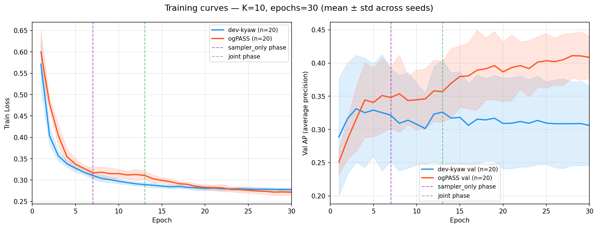
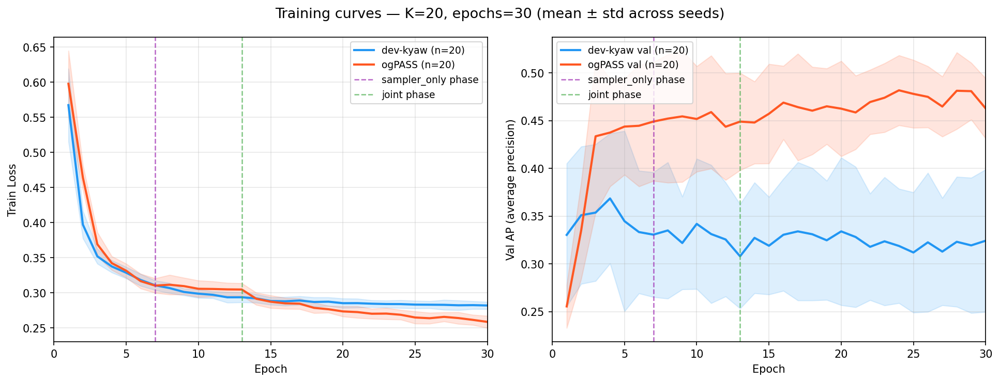
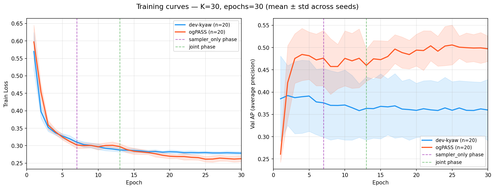
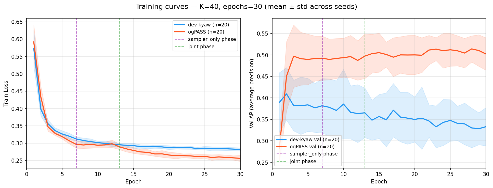
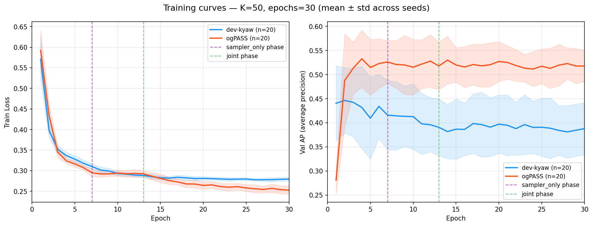

# ogPASS vs dev-kyaw — Interim Results (20 seeds, 30 epochs)

Generated: 2026-04-17 21:30 (updated with final K=20, K=40; K=300 running)  
Dataset: `rel-f1 / driver-top3` | Tune metric: AP (higher = better)  
Config: batch=32, layers=4, channels=512, lr=1e-4  
ogPASS 3-phase: warmup=6, sampler\_only=6, joint=18 epochs (20/20/60%)

---

## Cross-K Summary (Test AP)

| K | status | dev-kyaw AP | ogPASS AP | Δ AP (og−dev) | dev-kyaw std | ogPASS std | var ratio |
|--:|---|---|---|---|---|---|---|
| **10** | ✅ done | 0.3556 ± 0.0937 | 0.3689 ± 0.0241 | **+0.0133** ✅ | 0.0937 | 0.0241 | 0.26× |
| **30** | ✅ done | 0.4026 ± 0.1052 | 0.3800 ± 0.0276 | **-0.0226** | 0.1052 | 0.0276 | 0.26× |
| **50** | ✅ done | 0.4027 ± 0.0481 | 0.3758 ± 0.0388 | **-0.0268** | 0.0481 | 0.0388 | 0.81× |
| **20** | ✅ done | 0.3823 ± 0.0742 | 0.3713 ± 0.0216 | **-0.0110** | 0.0742 | 0.0216 | 0.29× |
| **40** | ✅ done | 0.4009 ± 0.0834 | 0.3762 ± 0.0269 | **-0.0247** | 0.0834 | 0.0269 | 0.32× |
| 300 | 🔄 running (6/20) | — | — | — | — | — | — |

> Variance ratio < 1.0 means ogPASS is more stable across seeds.

### Key takeaways so far

- **ogPASS wins AP only at K=10** (+0.013); dev-kyaw leads at all larger K
- **AP deficit grows monotonically with K:** −0.011 (K=20), −0.023 (K=30), −0.025 (K=40), −0.027 (K=50)
- **ogPASS is dramatically more stable** across seeds at all K (AP var ratio 0.26–0.32×, except K=50 at 0.81×)
- **ogPASS wins AUC at every K** by +0.035–0.071, suggesting better ranking even when AP lags
- The val→test gap for ogPASS is consistently ~2× larger than dev-kyaw, indicating the sampler's learned policy overfits to the val time period
- K=300 still running (6/20 seeds)

---

## Training Curves

### K=10

> ogPASS val AP rises continuously through all phases — no collapse at joint boundary.
> Wins on both AP (+0.013) and AUC (+0.071). The learned sampler helps when K is small.

### K=20

> ogPASS val AP clearly higher throughout training yet test AP slightly lower (Δ=−0.011, 20 seeds).
> AP var ratio 0.29× — ogPASS very stable. AUC: ogPASS +0.038.

### K=30

> ogPASS val AP consistently higher throughout training (~0.50 vs ~0.38),
> yet test AP is lower (−0.023). Clear val→test distribution mismatch amplified by the sampler.

### K=40

> dev-kyaw wins on AP (Δ=−0.025). ogPASS AP var ratio 0.32×, AUC +0.036.
> Deficit close to K=50 — the pattern has stabilised by K=40.

### K=50

> ogPASS val AP spikes during warmup/sampler_only then drops sharply at joint phase onset.
> dev-kyaw wins on test AP (−0.027). Joint training disrupts the sampler's learned policy.

---

## Per-K Detailed Results

### K=20 (partial — 6+6 seeds)

#### Val AP (best epoch) vs Test AP — partial

| branch | n | best val AP | test AP | gap |
|---|--:|--:|--:|--:|
| dev-kyaw | 6 | 0.4045 | 0.3835 ± 0.0681 | -0.0210 |
| ogPASS | 6 | 0.4768 | 0.3763 ± 0.0239 | -0.1005 |

#### Per-seed Val & Test AP — partial

| seed | dev-kyaw val | dev-kyaw test | ogPASS val | ogPASS test | Δ test |
|--:|--:|--:|--:|--:|--:|
| 0 | 0.4727 | 0.2602 | 0.5443 | 0.3376 | +0.0774 |
| 1 | 0.4046 | 0.4090 | 0.5273 | 0.4104 | +0.0014 |
| 2 | 0.4415 | 0.3466 | 0.4089 | 0.3715 | +0.0249 |
| 3 | 0.4733 | 0.4577 | 0.4700 | 0.3980 | -0.0597 |
| 4 | 0.3107 | 0.4541 | 0.4526 | 0.3798 | -0.0743 |
| 5 | 0.3244 | 0.3734 | 0.4574 | 0.3602 | -0.0132 |
| **mean** | **0.4045** | **0.3835** | **0.4768** | **0.3763** | **-0.0073** |
| **std** | | **0.0681** | | **0.0239** | |

### K=10

#### Val AP (best epoch) vs Test AP

| branch | n | best val AP | test AP | gap |
|---|--:|--:|--:|--:|
| dev-kyaw | 20 | 0.3936 | 0.3556 ± 0.0937 | -0.0380 |
| ogPASS | 20 | 0.4453 | 0.3689 ± 0.0241 | -0.0764 |

#### Per-seed Test AP

| seed | dev-kyaw | ogPASS | Δ |
|--:|--:|--:|--:|
| 0 | 0.3580 | 0.3841 | +0.0261 |
| 1 | 0.2594 | 0.3636 | +0.1042 |
| 2 | 0.2705 | 0.3821 | +0.1116 |
| 3 | 0.4568 | 0.3502 | -0.1066 |
| 4 | 0.4154 | 0.3734 | -0.0420 |
| 5 | 0.3433 | 0.3752 | +0.0319 |
| 6 | 0.3590 | 0.4002 | +0.0412 |
| 7 | 0.4411 | 0.4120 | -0.0292 |
| 8 | 0.3278 | 0.3642 | +0.0364 |
| 9 | 0.3255 | 0.3797 | +0.0542 |
| 10 | 0.4406 | 0.3786 | -0.0620 |
| 11 | 0.5876 | 0.3224 | -0.2652 |
| 12 | 0.3993 | 0.3931 | -0.0062 |
| 13 | 0.1669 | 0.3393 | +0.1725 |
| 14 | 0.3932 | 0.3656 | -0.0277 |
| 15 | 0.2815 | 0.3553 | +0.0738 |
| 16 | 0.3286 | 0.3716 | +0.0430 |
| 17 | 0.3240 | 0.3905 | +0.0665 |
| 18 | 0.2238 | 0.3609 | +0.1370 |
| 19 | 0.4096 | 0.3164 | -0.0933 |

### K=30

#### Val AP (best epoch) vs Test AP

| branch | n | best val AP | test AP | gap |
|---|--:|--:|--:|--:|
| dev-kyaw | 20 | 0.4537 | 0.4026 ± 0.1052 | -0.0510 |
| ogPASS | 20 | 0.5617 | 0.3800 ± 0.0276 | -0.1817 |

#### Per-seed Test AP

| seed | dev-kyaw | ogPASS | Δ |
|--:|--:|--:|--:|
| 0 | 0.3858 | 0.3998 | +0.0140 |
| 1 | 0.4317 | 0.3840 | -0.0477 |
| 2 | 0.5009 | 0.3431 | -0.1577 |
| 3 | 0.3709 | 0.3789 | +0.0080 |
| 4 | 0.2684 | 0.3610 | +0.0926 |
| 5 | 0.6267 | 0.3682 | -0.2584 |
| 6 | 0.5284 | 0.3589 | -0.1695 |
| 7 | 0.3599 | 0.3312 | -0.0287 |
| 8 | 0.5715 | 0.3634 | -0.2081 |
| 9 | 0.3499 | 0.3979 | +0.0480 |
| 10 | 0.2877 | 0.4136 | +0.1260 |
| 11 | 0.3798 | 0.3685 | -0.0114 |
| 12 | 0.2966 | 0.4231 | +0.1266 |
| 13 | 0.2695 | 0.3767 | +0.1072 |
| 14 | 0.4910 | 0.3934 | -0.0976 |
| 15 | 0.4841 | 0.4087 | -0.0754 |
| 16 | 0.2935 | 0.4087 | +0.1152 |
| 17 | 0.2991 | 0.3616 | +0.0625 |
| 18 | 0.4229 | 0.4217 | -0.0012 |
| 19 | 0.4347 | 0.3380 | -0.0967 |

### K=50

#### Val AP (best epoch) vs Test AP

| branch | n | best val AP | test AP | gap |
|---|--:|--:|--:|--:|
| dev-kyaw | 20 | 0.4979 | 0.4027 ± 0.0481 | -0.0953 |
| ogPASS | 20 | 0.5899 | 0.3758 ± 0.0388 | -0.2141 |

#### Per-seed Test AP

| seed | dev-kyaw | ogPASS | Δ |
|--:|--:|--:|--:|
| 0 | 0.4024 | 0.3602 | -0.0421 |
| 1 | 0.4076 | 0.3528 | -0.0548 |
| 2 | 0.3688 | 0.4136 | +0.0448 |
| 3 | 0.4017 | 0.3354 | -0.0663 |
| 4 | 0.3032 | 0.3815 | +0.0783 |
| 5 | 0.3899 | 0.3702 | -0.0197 |
| 6 | 0.4372 | 0.4329 | -0.0043 |
| 7 | 0.4026 | 0.4031 | +0.0005 |
| 8 | 0.4042 | 0.3296 | -0.0746 |
| 9 | 0.3960 | 0.3831 | -0.0129 |
| 10 | 0.3428 | 0.4085 | +0.0657 |
| 11 | 0.4379 | 0.3992 | -0.0387 |
| 12 | 0.5250 | 0.3463 | -0.1787 |
| 13 | 0.4303 | 0.4004 | -0.0299 |
| 14 | 0.3907 | 0.3690 | -0.0217 |
| 15 | 0.4220 | 0.4305 | +0.0085 |
| 16 | 0.4711 | 0.3356 | -0.1355 |
| 17 | 0.3312 | 0.3847 | +0.0536 |
| 18 | 0.3793 | 0.4037 | +0.0245 |
| 19 | 0.4093 | 0.2763 | -0.1330 |
